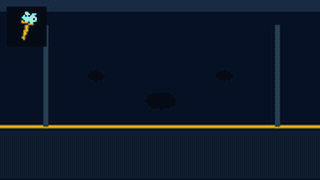
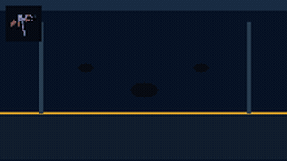
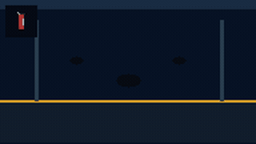
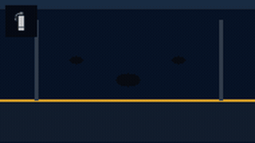
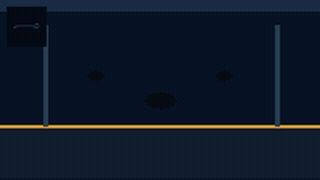
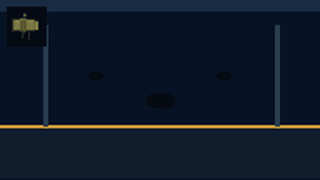

# Fluid Playground for Godot（Godot 4 + C#）

本项目依照 3c0tr 的 Unity 项目 [FluidPlayGround](https://github.com/3c0tr/FluidPlayGround) 转换为 Godot 4 .NET / C# 版本，并针对 Godot 项目接入、CPU 模拟、边界安全、烟雾渲染和新手 SDK API 做了一些调整与简化。

原作者演示视频：Bilibili `BV1RPb8zAEzY`

原 Unity 项目及原始素材版权归原作者 3c0tr 及其相应权利人所有。本仓库的 Godot 转换与调整部分计划以 MIT License 开源；

> 推荐入口：日常业务只使用 `FluidManager`。`FluidSimulation` 和 `FluidCanvas` 是为复杂定制保留的高级层。

## 特性

- Godot 4.6.2 .NET / C#，核心代码不依赖 GDScript。
- 固定数组 CPU 流体场：染料、速度、衰减、压力、粘性和网格障碍。
- 独立烟雾浓度场：灰烟不会再被彩色染料污染。
- 可实时修改烟雾中心色、边缘色、边缘强度和不透明度。
- 用四邻域浓度梯度近似“中心较浅、边缘较深”的原 Demo 烟雾观感，时间复杂度仍为 `O(宽 × 高)`。
- 对 NaN、Infinity、越界坐标、负半径和极端速度做安全保护。
- 所有常用导出变量和公共 API 均带中文 XML 文档，可直接在 Inspector 查看。

## 道具效果预览

<table>
  <tr>
    <td width="33%" align="center"><br><sub><b>1 · 画笔</b></sub></td>
    <td width="33%" align="center"><br><sub><b>2 · AK-47</b></sub></td>
    <td width="33%" align="center"><br><sub><b>3 · 灭火器</b></sub></td>
  </tr>
  <tr>
    <td width="33%" align="center"><br><sub><b>4 · 烟雾弹</b></sub></td>
    <td width="33%" align="center"><br><sub><b>5 · 魔法信号枪</b></sub></td>
    <td width="33%" align="center"><br><sub><b>6 · 火箭筒</b></sub></td>
  </tr>
</table>

## 环境、首次初始化与启动

需要安装：

- **Godot 4.6.2 .NET/Mono** 编辑器；普通版 Godot 不能运行 C# 项目。
- **.NET SDK 9**，可使用 `dotnet --version` 检查。

项目目标框架是 `net9.0`。如果升级 Godot，请同步修改 `FluidPlayground.csproj` 的 `Godot.NET.Sdk` 版本、目标框架以及 `.nuget-offline` 中的离线包。

项目已经提交匹配 Godot 版本的离线 NuGet 包，因此首次构建不需要访问 nuget.org。从仓库根目录执行：

```bash
cd godot_fluid
dotnet restore FluidPlayground.csproj
dotnet build FluidPlayground.csproj --no-restore
```

首次构建必须先运行 `dotnet restore`，或者直接运行会自动还原的命令：

```bash
dotnet build FluidPlayground.csproj
```

不要在一个尚未还原的新副本中直接使用 `dotnet build --no-restore`；否则会因为缺少 `.godot/mono/temp/obj/project.assets.json` 而出现 `NETSDK1004`。

### 生成完整的 `.godot/` 目录

`dotnet restore/build` 会生成 `.godot/mono/temp/` 下的 C# 还原和构建文件。Godot 的资源导入缓存、场景缓存等其余内容则由 Godot 编辑器生成。

推荐使用图形界面：

1. 启动 Godot 4.6.2 .NET/Mono。
2. 选择 **Import/Open**，打开本目录的 `project.godot`。
3. 等待资源导入完成，再执行 **Build → Build Project**。
4. 打开并运行 `Main.tscn`。

如果 Godot 可执行文件已经加入 `PATH`，也可以在项目目录无界面地完成资源导入：

```bash
godot --headless --path . --import
godot --headless --path . --build-solutions --quit
```

macOS 若未配置 `PATH`，请将下面的应用路径改为自己的 Godot .NET/Mono 安装位置：

```bash
"/Applications/Godot_mono.app/Contents/MacOS/Godot" --headless --path . --import
"/Applications/Godot_mono.app/Contents/MacOS/Godot" --headless --path . --build-solutions --quit
```

`.godot/` 是每台机器自行生成的缓存目录，已被 `.gitignore` 忽略，不应提交到 Git。项目路径和各级目录名不要以空格结尾，以免 IDE、NuGet 或自动化脚本解析出错。

### 日常构建与故障恢复

完成首次还原后，日常只需执行：

```bash
dotnet build FluidPlayground.csproj --no-restore
```

如果再次出现 `NETSDK1004`，或 C# 临时构建缓存损坏，请先关闭 Godot，再执行：

```bash
rm -rf .godot/mono/temp
dotnet restore FluidPlayground.csproj
dotnet build FluidPlayground.csproj --no-restore
```

如果资源导入缓存也已损坏，可以重建整个缓存目录：

```bash
rm -rf .godot
dotnet restore FluidPlayground.csproj
dotnet build FluidPlayground.csproj --no-restore
godot --headless --path . --import
godot --headless --path . --build-solutions --quit
```

最后一个命令同样可以改为使用 Godot 图形界面打开 `project.godot`。删除 `.godot/` 不会删除项目源码、场景或素材。

### Inspector 显示 `no description available`

C# 的 `///` 注释只有被编译成程序集旁边的 XML 文档，并由 Godot 刷新“脚本文档缓存”后才能显示。本项目已经在 `FluidPlayground.csproj` 中启用 `GenerateDocumentationFile`。

仅执行 `dotnet build` 会生成 XML，但不会通知已经打开的 Godot 编辑器重新加载脚本文档。请关闭当前 Godot 项目窗口，在项目目录执行：

```bash
dotnet restore FluidPlayground.csproj
godot --headless --path . --build-solutions --quit
```

macOS 未将 Godot 加入 `PATH` 时，使用实际可执行文件路径，例如：

```bash
"/Applications/Godot_mono.app/Contents/MacOS/Godot" --headless --path . --build-solutions --quit
```

然后重新打开项目并检查：

1. 必须使用 **Godot .NET/Mono**，不能使用普通版编辑器。
2. 确认 `.godot/mono/temp/bin/Debug/FluidPlayground.xml` 存在且不为空。
3. 打开 `Main.tscn`，选中带有 C# 脚本的 `FluidManager` 节点。
4. 将鼠标停在 Inspector 左侧的 `Grid Width` 等属性名称上，而不是数值输入框上。

若仍显示旧缓存，关闭 Godot 后完整重建：

```bash
rm -rf .godot
dotnet restore FluidPlayground.csproj
godot --headless --path . --import
godot --headless --path . --build-solutions --quit
```

`--build-solutions` 是关键步骤：它由 Godot 执行 C# 构建，并在编辑器生命周期内重新注册 XML 描述。删除 `.godot/` 不会删除项目源码、场景或素材。

macOS 上如果重建项目缓存后仍无描述，通常是 Godot 的全局文档缓存仍停留在旧版本。关闭所有 Godot 窗口，先把缓存移动为带时间戳的备份，再重新构建：

```bash
mv ~/Library/Caches/Godot/editor_doc_cache-4.6.res \
   ~/Library/Caches/Godot/editor_doc_cache-4.6.res.backup-$(date +%Y%m%d-%H%M%S)
godot --headless --path . --build-solutions --quit
```

Godot 会自动重新生成该缓存；原文件仍以 `backup-*` 名称保留，可以恢复。Linux 对应缓存通常位于 `~/.cache/godot/`。

## 最快接入方式

将以下内容复制到自己的 Godot 4 .NET 项目：

- `Scripts/FluidManager.cs`
- `Scripts/FluidSimulation.cs`
- `Scripts/FluidCanvas.cs`
- `FluidManager.tscn`（推荐，但也可自行创建 Node2D 挂载脚本）

把 `FluidManager.tscn` 拖进场景，然后在业务脚本中获取它：

```csharp
using Godot;
using GodotFluid;

public partial class FluidExample : Node2D
{
	private FluidManager _fluid;

	public override void _Ready()
	{
		_fluid = GetNode<FluidManager>("../FluidManager");
	}

	public override void _UnhandledInput(InputEvent inputEvent)
	{
		if (inputEvent is not InputEventMouseButton mouse || !mouse.Pressed)
			return;

		Vector2 position = _fluid.ViewportToFluid(mouse.Position);

		if (mouse.ButtonIndex == MouseButton.Left)
		{
			_fluid.AddFluid(
				position,
				Colors.DodgerBlue,
				radius: 0.04f,
				velocity: new Vector2(0.5f, -0.1f),
				halfLifeSeconds: 2f);
		}
		else if (mouse.ButtonIndex == MouseButton.Right)
		{
			_fluid.AddSmoke(
				position,
				radius: 0.09f,
				velocity: new Vector2(0f, -0.18f),
				halfLifeSeconds: 2.5f,
				amount: 1f);
		}
	}
}
```

所有位置均采用归一化坐标：左上 `(0, 0)`、中心 `(0.5, 0.5)`、右下 `(1, 1)`。鼠标、触摸屏像素坐标请先通过 `ViewportToFluid()` 转换。

## 常用 SDK API

### 液体、烟雾和冲击

```csharp
// 彩色液体
fluid.AddFluid(position, Colors.Cyan, 0.04f, Vector2.Zero, 2f);

// 独立烟雾：半径、初速度、半衰期、浓度倍率
fluid.AddSmoke(position, 0.09f, new Vector2(0f, -0.18f), 2.5f, 1f);

// 正数向外推，负数向内吸
fluid.AddImpulse(position, radius: 0.12f, strength: 2f);
```

`halfLifeSeconds` 小于 0 时使用 Inspector 默认值，等于 0 时不自动衰减，大于 0 时表示浓度降到一半所需秒数。

### 实时控制烟雾颜色

Inspector 的 `烟雾外观（实时可调）` 分组包含：

| 参数 | 默认值/意义 |
| --- | --- |
| `Smoke Color` | 中心中性浅灰；运行时修改会影响现有烟雾 |
| `Smoke Edge Color` | 深灰轮廓色 |
| `Smoke Edge Strength` | `0.72`；0 关闭深色边缘，1 最明显 |
| `Smoke Opacity` | `1.15`；只影响显示，不改变模拟浓度和寿命 |

业务代码可以直接赋值，也可以一次调用：

```csharp
// 例如把所有现有烟雾实时变为绿色毒雾。
fluid.SetSmokeAppearance(
	centerColor: new Color("a8d5ad"),
	edgeColor: new Color("294f31"),
	edgeStrength: 0.8f,
	opacity: 1.25f);
```

`AddSmoke(..., amount)` 控制单次释放的模拟浓度；`SmokeOpacity` 控制全局显示浓度。两者分开设计，便于只改视觉而不改变压力、平流和衰减行为。

### 障碍、暂停和清理

```csharp
fluid.SetObstacle(position, radius: 0.03f, solid: true);  // 绘制障碍
fluid.SetObstacle(position, radius: 0.03f, solid: false); // 擦除障碍

fluid.Pause();
fluid.Resume();
fluid.TogglePaused();

fluid.ClearFluid();     // 清除液体和烟雾，保留障碍
fluid.ClearObstacles(); // 清除障碍，保留流体
fluid.ClearAll();       // 全部清空
```

## Inspector 调参建议

| 参数 | Demo 默认值 | 作用 |
| --- | ---: | --- |
| `Grid Width / Height` | 192 × 108 | 细节与 CPU/纹理上传成本；修改后需重新进入场景 |
| `Pressure Strength` | 0.45 | 高浓度区域向外铺开的速度 |
| `Advection Scale` | 0.22 | 速度换算为画面位移的比例 |
| `Viscosity` | 1.40 | 越大越平滑、粘稠，细碎旋涡越少 |
| `Max Velocity` | 3.0 | 数值安全速度上限 |
| `Default Fluid Half Life Seconds` | 1.82s | 未指定寿命时的浓度半衰期 |
| `Velocity Half Life Seconds` | 0.92s | 停止施力后速度衰减速度 |
| `Gravity / Buoyancy` | 0 | 默认关闭，以贴近原 Demo 无全局下坠行为 |

推荐分辨率：移动端 `128×72`，普通桌面 `192×108`，高细节 `320×180`。CPU 和纹理上传成本大致随网格单元数量线性增长。

## Demo 操作

- `1` 画笔：拖动注入彩色染料。
- `2` AK-47：按住产生小范围命中冲击。
- `3` 灭火器：按住喷射快速消散的冷色流体。
- `4` 烟雾弹：释放中性灰烟雾，中心浅、边缘深。
- `5` 魔法信号枪：注入高亮暖色流体。
- `6` 火箭筒：制造大范围染料和径向冲击。
- 鼠标滚轮、`Q/E` 或数字键：切换工具。
- 右键拖动：绘制障碍；`Shift + 右键`：擦除障碍。
- `Space`：暂停/继续；`R`：清空。

画笔仍使用 HSV 动态彩色，这是展示 RGB 染料混合的独立工具；烟雾弹已经改用独立烟雾场，因此不会继承画笔的随机色彩。

## 目录结构

| 文件 | 作用 |
| --- | --- |
| `FluidManager.tscn` | 可直接拖入其他场景的 SDK 节点 |
| `Scripts/FluidManager.cs` | 面向新手的统一入口和导出参数 |
| `Scripts/FluidSimulation.cs` | 纯 C# 数值模拟、数组和安全边界 |
| `Scripts/FluidCanvas.cs` | ImageTexture 上传及烟雾边缘着色 |
| `Scripts/Main.cs` | Demo UI、输入和工具逻辑；正式项目可不复制 |
| `SDK_GUIDE.md` | 更短的新手逐步教程 |

`AdvancedSimulation` 与 `AdvancedCanvas` 仅用于固定时间步、多模拟域、自定义渲染或新算法等高级需求。普通项目优先依赖 `FluidManager`，这样未来替换底层实现时业务脚本无需一起修改。

## NuGet 离线目录

- `.nuget-offline/`：保存与 Godot 4.6.2 匹配的原始 `.nupkg`，让项目可以离线恢复；需要提交。
- `.nuget-packages/`：NuGet 解压后的本地工作缓存，约 25 MB，可随时重建；不要提交。
- `.godot/mono/temp/`：程序集、XML 文档等 Godot C# 构建输出；可重建，不提交。

`NuGet.Config` 当前使用 `<clear />` 保证离线、可重复构建。需要第三方 NuGet 库时，再加入 nuget.org 或团队包源。

## 与 Unity 原版的取舍

本版本保留流体交互核心，但没有原样复制 RenderTexture/CommandBuffer/ComputeBuffer、完整武器实体、Prefab、对象池和 Marching Squares 阴影。Godot 版本改用固定数组和 `ImageTexture`，以更少的生命周期对象换取更容易嵌入、调试和维护的 C# SDK。

原 Demo 素材仅用于转换效果对照。若要公开发布或商用，请自行确认每项代码、图片和音视频素材的许可。

## 开源与署名

- 上游项目：`3c0tr/FluidPlayGround`
- 上游作者视频：Bilibili `BV1RPb8zAEzY`
- Godot 转换与调整：本仓库维护者
- 计划许可证：Godot 转换代码 MIT（第三方代码和素材仍遵循各自原许可证）
